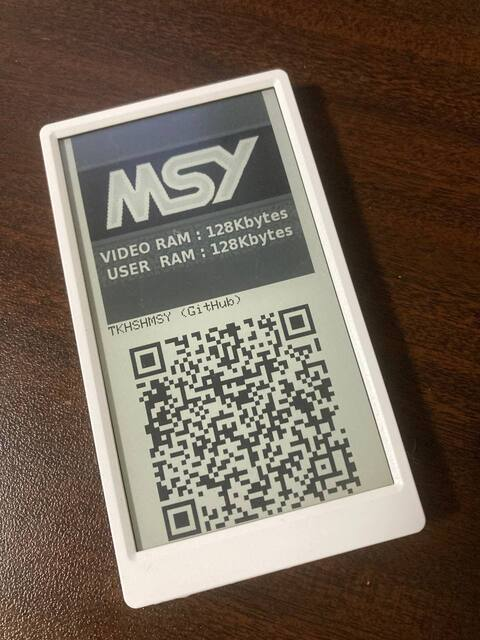

# ESP32-NameCard
NameCard with M5Paper



## How to use
* G37/G39: show Next/Prev card.
* G38: wake up from deep sleep
* Enters deep sleep after 1 min without any operation.

## How to configure
* make directory '/namecard/' on SDCard
  * put Json file 'namecard.json'
  * also put PNG files

### JSON format

/namecard/namecard.json on SDCard.

```json
{
	"cards": [
		{
			"logo": "/namecard/file.png",
			"name": "Name",
			"url": "https://google.com"
		}
	]
}
```

* "cards"
  * "logo": path to PNG file
  * "name": Text
  * "url": QRCode

## License
* MIT

## Author
* tkhshmsy@gmail.com